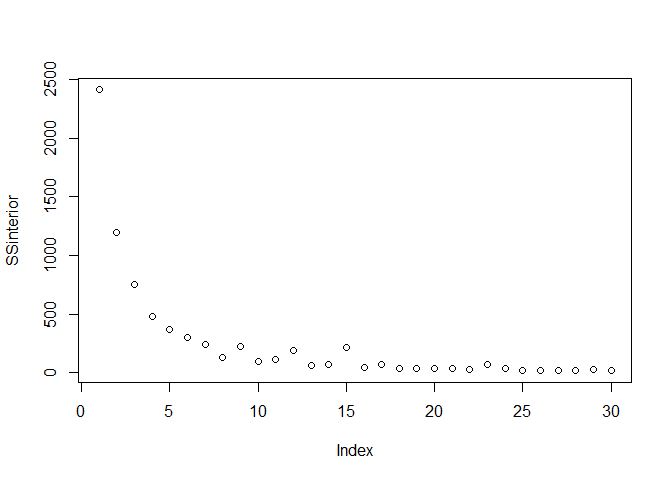
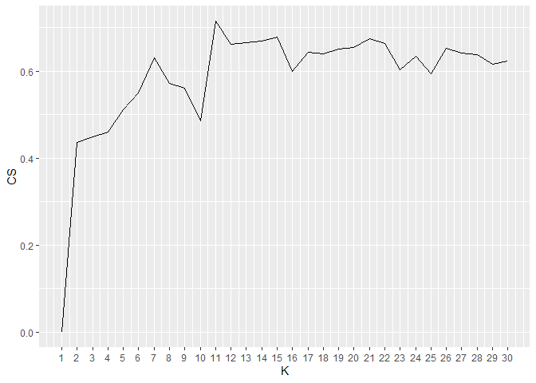

Tarea 5; Estivaliz Rosales
================

Realizar análisis de agrupamiento (K-means, incluye preprocesamiento de
los datos) e índices de evaluación para el archivo “sandwiches.csv”
tomando las columnas de nota y precio. Hacer análisis para diferentes K
y / o medidas de distancia para que vean cómo se comporta el clustering
(En caso de tener algún problema con ese csv, pueden utilizar el csv de
Pokémon también para la actividad)

## Cargar datos y librerias

Como bien sabemos, lo primero que debemos hacer es cargar los datos a
nuestro R, en conjunto con las librerias.

``` r
library(tidyverse)
```

    ## -- Attaching packages --------------------------------------- tidyverse 1.3.0 --

    ## v ggplot2 3.3.3     v purrr   0.3.4
    ## v tibble  3.1.0     v dplyr   1.0.5
    ## v tidyr   1.1.3     v stringr 1.4.0
    ## v readr   1.4.0     v forcats 0.5.1

    ## -- Conflicts ------------------------------------------ tidyverse_conflicts() --
    ## x dplyr::filter() masks stats::filter()
    ## x dplyr::lag()    masks stats::lag()

``` r
library(ggplot2)
library(datasets)
library(cluster)
library(factoextra)
```

    ## Warning: package 'factoextra' was built under R version 4.0.5

    ## Welcome! Want to learn more? See two factoextra-related books at https://goo.gl/ve3WBa

``` r
setwd("C:/Users/JuanRosales/OneDrive/Mineria de datos/tarea 5")
datos  <- read.csv("sanguchez.csv",sep=";")
head(datos)
```

    ##                                                               url
    ## 1          https://365sanguchez.com/abocado-cantina-buenos-aires/
    ## 2                   https://365sanguchez.com/alba-hotel-matanzas/
    ## 3   https://365sanguchez.com/albedrio-restaurant-santiago-centro/
    ## 4 https://365sanguchez.com/albedrio-restaurant-santiago-centro-2/
    ## 5              https://365sanguchez.com/aldea-nativa-providencia/
    ## 6            https://365sanguchez.com/aleman-experto-providencia/
    ##                 Local                                         Direccion  Precio
    ## 1     Abocado Cantina   C1125AAE, French 2316, C1125AAF CABA, Argentina $5.210.
    ## 2          Alba Hotel   Carlos Ibañez del Campo s/n – Matanzas, Navidad  $7.000
    ## 3 Albedrio Restaurant     Huérfanos 640, Santiago, Región Metropolitana  $7.290
    ## 4 Albedrío Restaurant Pasaje Huerfanos 640 edificio B local 5, Santiago  $8.690
    ## 5        Aldea Nativa  Tobalaba 1799, Providencia, Región Metropolitana  $4.900
    ## 6      Alemán Experto Av. Pedro de Valdivia 1683, Providencia, Santiago  $6.500
    ##                                                                                                                  Ingredientes
    ## 1                                               Suprema de pollo dulce, espinaca, crema ácida, repollo avinagrado y guacamole
    ## 2                     Carne mechada en reducción de vino tinto, champiñones salteados, cebolla caramelizada y queso derretido
    ## 3                          Mayonesa al olivo, champiñones salteados, jalapeños, queso Mozzarella, papas hilo y cebolla morada
    ## 4                          Queso Mozzarella, Rúcula, Champiñon portobello relleno de cheddar y luego apanado en panko y frito
    ## 5 Tofu asado no transgénico, palta, tomate, champiñones, mix de hojas verdes orgánicas,  mayonesa de zanahoria vegana casera,
    ## 6                           Hamburguesa, queso Cheddar, cebolla caramelizada, berros, pepinillos y salsa Jack Daniel’s Honey.
    ##   nota
    ## 1    3
    ## 2    3
    ## 3    4
    ## 4    4
    ## 5    4
    ## 6    3
    ##                                                                                                                                                                                                                                                                                                                                                                                                                                                                                                                                                                                                                                                                                                                                                                                                                                                                                                                                                                                                                                                                                                                                                                                                                                                                                                                                                                                                                                                                                                                                                                                                                                                                                                                                                                                                                                                                                                                                                                                                                                                                                                                                                                                                                                                                                                                                                                                                                                                                                                                                                                                                                                                                                                                                                                                                                                                                                                                                                                                                                                                                                                                                                                                                                                                                                                                                                                                                                                                                                                                                                                                                                                                                                                                                                                                                                                                                                                                               texto
    ## 1                                                                                                                                                                                                                                                                                                                                                                                                                                                                                                                                                                                                                                                                                                                                                                                                                                                                                                                                                                                                                                                                                                                                                                                                                                                                                                                                                                                                                                                                                                                                                                                                                                                                                                                                                                                                                                                                                                                                                                                                                                                                                                                                                                                                                                                                                                                                                                                                                                                                                                                                                                                                                                                                                                                                                                                                                                                                                                                                                                                                                                                                                                                                                                                  Ojo acá! En la sanguchería “Abocado” (@AbocadoCantina) de Recoleta, más que un sándwich exquisito (que igual estaba bueno), descubrí una maravilla para copiar: acá el apanado, el frito del pollo, era dulce. Y bien crocante. Exquisito. Les juro que es el mejor apanado que he probado en mi vida. A esta suprema de pollo dulce, la acompañaban con espinaca (yo la hubiese puesto a la crema), crema ácida, repollo avinagrado y guacamole. Lamentablemente, la palta acá en Argentina no es como la chilena. Es más aguachenta. Y el pan, nuevamente sigue la línea que me ha tocado en este país, que no logra ser del nivel que tenemos en Chile. Pero insisto: ese batido hay que exportarlo. Estaba exquisito. Y sigo pensando en él.
    ## 2                                                                                                                                                                                                                                                                                                                                                                                                                                                                                                                                                                                                                                                                                                                                                                                                                                                                                                                                                                                                                                                                                                                                                                                                                                                                                                                                                                                                                                                                                                                                                                                                                                                                                                                                                                                                                                                                                                                                                                                                                                                                                                                                                                                                                                                                                                                                                                                                                                                                                                                                                                                                                                                                                                                                           Aprovechando que me escapé a Matanzas con @catabarra_ a canjear mi regalo de cumpleaños (clases de surf), quise probar algunos sanguchitos de la zona. Y como hace un año me quedé a alojar en @albahotelboutique y tuve una muy buena experiencia, hoy quise darle una oportunidad a su carta de comida. Y a pesar de que en general nos fue bastante mal (3 de los platos andaban muuuy bajos), mi sanguchito salvó muy bien. Y es que la mezcla de carne mechada en reducción de vino tinto, champiñones salteados, cebolla caramelizada en marraqueta (y le sumé queso derretido), es demasiado buena. No falla. Así que de 1 a 5, este se lleva 3 narices de chancho. Es decir, es un buen sándwich. Vaya a probarlo con confianza. Una marrquetita crujiente y de poca miga, una mechada muy suave y harto queso son sus puntas de lanzas. Sí, hay cosas por mejorar. Por ejemplo, las “mechas” de la carne como que se pegaban unas a otras, entonces a veces de un mordisco te llevabas casi toda la carne. O el caldo lo haría más intenso. Porque lo que chorreaba aquí eran los champiñones más que la carne. Pero apaña harto, además que estás comiendo EN la playa misma.
    ## 3                                                                                                                                                                                                                                                                                                                                                                                                                                                                                                                                                                                                                                                                                                                                                                                                                                                                                                                                                                                                                                                                                                                                                                                                                                                                                                                                                                                                                                                                                                                                                                                                                                                                                                                                                                                                                                                                                                                                                                                                                                                                                                                                                                                                                                                                                                                                                                                                                                                                                                                                                                                                                                                                                                                                                                                                                                                                                                                                                                                                                                                                                                                                                                                                            Sin duda, uno de los lugares que me ENCANTA visitar. Lejos la mejor hamburguesa que tienen es la Portobello (con un champiñón frito relleno de Cheddar y todo), pero como no estamos en temporada de hongos, no había ahora. Esa, sin duda, se lleva cinco narices. Hoy vine a @RestoAlbedrio con@MaxKbzon y nos dimos la torta comiendo. Él fue por un sándwich de prieta con manzana verde, papas hilo y mayo de ají verde. Yo, una burger “Picante”, con mayonesa al olivo, champiñones salteados, jalapeños, queso Mozzarella, papas hilo y cebolla morada. Solo les adelanto una cosa: tienen una salsa de reducción de cerveza con jugo de piña y azúcar rubia, que debiesen venderla en bidones!! Es EXQUISITA!
    ## 4                                                                                                                                                                                                                                                                                                                                                                                                                                                                                                                                                                                                                                                                                                                                                                                                                                                                                                                                                                                                                                                                                                                                                                                                                                                                                                                                                                                                                                                                                                                                                                                                                                                                                                                                                                                                                                                                                                                                                                                                                                                                                                                                                                                                                                                                                                                                                                                                                                                                                                                                    Con @nitanzorron fuimos a probar esta maravilla de @albedrio_resto. Anoten: hamburguesa casera, queso mozzarella, rúcula y champiñon portobello relleno de cheddar y luego apanado en panko y frito . Una maravilla! Es que los champiñones rellenos ya son atómicos… Pero ahora que vienen fritos, tienes un sabor estratosférico. La mejor idea del mundo. Es una verdura muy “carnosa” y rica, realzada por el queso y el apanado. El toque amargo de la rúcula viene bien, y la hamburguesa en sí, creo que es la más jugosa que he probado. Me recordó a la de Ciudad Vieja. Anda perfecta. El pan Brioche, bien dulce, y de miga consistente. No tan aireada. Mi único punto a mejorar es que sentí que era muy “aguado” (los champiñones tienen alto porcentaje de agua), por lo que me faltó malicia. Un picante, o una salsa de ajo… No sé. Algo que te vuele la cabeza. De hecho, Albedrío tiene dos salsas que creo que pondrían a esta hamburguesa en el top chileno: la de la casa, que es una reducción de cerveza, pulpa de piña y azúcar rubia, y una mayonesa con cilantro y ajo que es perfecta. Con @nitanzorron conversamos que agregando esa salsa, el sandwich sube de nivel a SS3. Muy buena. Vayan a ver nuestra visita a mi canal de YouTube (link en mi perfil) para todos los detalles y comenten si les tinca porque encuentro que es mega creativa y muuuuy rica.
    ## 5                                                                                                                                                                                                                                                                                                                                                                                                                                                                                                                                                                                                                                                                                                                                                                                                                                                                                                                                                                                                                                                                                                                                                                                                                                                                                                                                                                                                                                                                                                                                                                                                                                                                                                                                                                                                                                                                                                                                                                                                                                                                                                                                                                                                                                                                  Ojo los vegetarianos!! Porque gracias a@genoveva_tenaillon (síganla si quieren ver unas recetas exquisitas pero saludables al mismo tiempo) que me pasó el dato, encontré el templo de los sándwiches vegetarianos y jugos naturales wenos wenos wenos. Es Aldea Nativa, en Tobalaba, y a pesar de que es 99% más probable que prefiera un sándwich carnívoro, creo que los que probé acá son de los mejorcitos que me han tocado (hasta ahora, en La Tegualda están los mejores). El Barros Luco de la Geno estaba bien bueno (con carne de libre pastoreo, sin hormonas ni antibióticos… Y no, claramente este no era veggie jaja), pero me gustó más el mío: tofu asado no transgénico, palta, tomate, champiñones, mix de hojas verdes orgánicas, y le sumé una mayonesa de zanahoria vegana casera, que viene con todos los sándwiches (échensela entera). A ver. Era rico, pero la nota se la lleva principalmente porque es el mejor tofu que he probado en Chile. En general lo cocinan muy fome, pero este estaba marinado en soya y asado a la plancha, así que tenía un gustito distinto al típico “quesillo sin sabor” jajaj. Además, venía como con un cevichito de champiñones que también se lo puse adentro  y agarró una jugosidad que el pan agradeció. Con estos dos ingredientes que le puse, las verduras agarraron un aliño exquisito. De los vegetarianos que he probado, es de los más ricos. Pero si no te gusta el Tofu, también puedes probar alguna de las hamburguesas vegetarianas que tienen. Me gustó harto el lugar, además de que también es un mercado donde venden miles de productos orgánicos, vegetarianos y de esa onda.
    ## 6 Salsa de bourbon: checkAlemán ExpertoCómo llegué a Alemán ExpertoYa había venido un par de veces al Alemán Experto. Tanto al local de Santa Magdalena, como a este de Pedro de Valdivia. En todas las visitas tuve suerte dispar. En algunos me gustó harto, otras no tanto.La cosa es que hoy tuve que hacer trámites cerca, y como tenía poco tiempo para buscar una sanguchería, preferí ir al Alemán Experto, que aún no lo sumaba a 365 Sánguchez.Fotos tomadas con mi celular Sony Xperia XRestaurante y sanguchería Alemán ExpertoAlemán Experto es una sanguchería que cuenta con dos locales. El primero está en Santa Magdalena, y el otro en Pedro de Valdivia, en la esquina con Francisco Bilbao. Ojo, que también están abriendo uno en La Dehesa.Este restaurante es, tal como lo dice su nombre, bien alemán. Es decir, abundan los sánguches grandes y la cerveza.Hablando del local de Pedro de Valdivia, siento que hicieron un gran trabajo con su fachada exterior. Si no me creen, miren la foto de más arriba. Y es que la terraza que sacaron está increíble. Además, por su ubicación, siempre hay gente, por lo que me tinca que se arma buen ambiente para los after office.Les dejo su pagina web. Carta de sándwiches Alemán ExpertoLa carta de sándwiches del Alemán Experto es amplia, tanto en sus bases, como también en sus combinaciones gourmet y clásicas.Por el lado más jugado, la sanguchería Alemán Experto cuenta con hamburguesas y mechadas BBQ. De las primeras, destacan una que tiene camarones y queso azul ($6.400), y la que pedí yo. Se llama Jack Daniel’s Honey, y tiene una salsa basada en ese licor, además de queso Cheddar, berros, cebolla caramelizada y pepinillos.En las mechadas BBQ, hay dos opciones. una con tocino crispy, y la otra con queso Azul y aros de cebolla.Luego de esta sección más “gourmet”, Alemán Experto también cuenta con hamburguesas, churrascos, lomitos, aves, salchichas y mechadas para poder armarlas como italianos, lucos y chacareros.Para terminar, hay una sección de sándwiches vegetarianos. Son hamburguesas de quinoa, y tiene cuatro combinaciones distintas. Hamburguesa Jack Daniel’s Honey en Alemán ExpertoA pesar de no ser un fanático del bourbon, admito que sí me gusta esta variante con toques de miel. Y en una salsa, mejor aún.Tengo que decir que es un sándwich correcto. La salsa no se roba el protagonismo, y aporta un toque justo de dulzor y también de “malicia”.La cebolla caramelizada estaba suave, y los berros perfectos para contrastar el frescor con lo dulce de la cebolla y la salsa.Lo que no me gustó tanto, es que la hamburguesa estaba un poco seca. Tuvo suerte, eso sí, de que venía acompañada con harta salsa, por lo que lograba pasar piola. Pero si nos quedamos en la carne, le falta.Y el otro punto negativo, y esto ya parece que es una maldición que me persigue, fue el queso Cheddar. Primero, porque no estaba derretido. Cueck. Y segundo, porque su sabor era demasiado plástico. Les prometo que tengo ganas de hacer una cata de quesos Cheddar, quizás con Daniel Greve, para poderles recomendar cuáles son buenos. Pero este, no.Maridaje con Cerveza Austral LagerEn resumen: Alemán Experto puede ser experto en otras cosas, pero no en hamburguesasRecién ahora, que estoy escribiendo estas líneas, me doy cuenta que quizás hice una movida tonta. Si voy a un lugar que se llama Alemán Experto, lo normal sería haber pedido un lomito. Con chucrut, con pepinillos… algo por ahí.Se supone que los alemanes también le pegan a las fricandelas, pero este no fue el caso. De hecho, la carne no era tan especiada como suele serlo en ese país. Pero aún así, me tinca que el lomito aquí puede ser un gran acierto.Quedé con ganas de volver. Volver y probar otra proteína, como el lomito o la mechada. Así que nos vemos pronto, Alemán Experto.

## Borrar datos

Como solo utilizaremos dos columnas, borraremos todas las demas para
trabajar con mas comodidad. Tambien borraremos todos los datos nulos
para disminuir la BBDD

``` r
datos <- datos[,! (colnames(datos) %in% c("url","Local","Direccion","Ingredientes","texto"))]

datos <- na.omit(datos)
head(datos)
```

    ##    Precio nota
    ## 1 $5.210.    3
    ## 2  $7.000    3
    ## 3  $7.290    4
    ## 4  $8.690    4
    ## 5  $4.900    4
    ## 6  $6.500    3

## Misma clase de datos

Para poder gacer una correcta comparacion, necesitamos que en la base de
datos solo exista un tipo de datos, y el precio es un caracter ya que
posee “$”, puntos y comas. Por lo que procederemos a borrar dichos
elementos para convertir nuestra variable a un numero.

``` r
datos$Precio <- as.numeric(gsub('[$.]', '', datos$Precio))
```

    ## Warning: NAs introducidos por coerción

``` r
head(datos)
```

    ##   Precio nota
    ## 1   5210    3
    ## 2   7000    3
    ## 3   7290    4
    ## 4   8690    4
    ## 5   4900    4
    ## 6   6500    3

``` r
datos <- datos[complete.cases(datos), ]
summary(datos)
```

    ##      Precio           nota      
    ##  Min.   :  600   Min.   :1.000  
    ##  1st Qu.: 4892   1st Qu.:3.000  
    ##  Median : 5990   Median :3.000  
    ##  Mean   : 6061   Mean   :3.154  
    ##  3rd Qu.: 7100   3rd Qu.:4.000  
    ##  Max.   :14500   Max.   :5.000

## Boxplot´s

Usaremos estas imagenes como primera aproximacion para realizar el
analisis.

``` r
pre=boxplot(datos$Precio, horizontal =TRUE)
```

<!-- -->

``` r
stats_pre = boxplot.stats(datos$precio)
pre
```

    ## $stats
    ##      [,1]
    ## [1,] 1650
    ## [2,] 4890
    ## [3,] 5990
    ## [4,] 7100
    ## [5,] 9900
    ## 
    ## $n
    ## [1] 358
    ## 
    ## $conf
    ##          [,1]
    ## [1,] 5805.453
    ## [2,] 6174.547
    ## 
    ## $out
    ## [1] 12900 10700 14500 10500   600 10800  1550 12900
    ## 
    ## $group
    ## [1] 1 1 1 1 1 1 1 1
    ## 
    ## $names
    ## [1] "1"

``` r
stats_pre
```

    ## $stats
    ## [1] NA NA NA NA NA
    ## 
    ## $n
    ## [1] 0
    ## 
    ## $conf
    ## [1] NA NA
    ## 
    ## $out
    ## NULL

``` r
datos<-filter(datos, Precio <10500)
boxplot(datos$Precio, horizontal = TRUE)
```

<!-- -->

``` r
not=boxplot(datos$nota, horizontal =TRUE)
```

<!-- -->

``` r
stats_not = boxplot.stats(datos$nota)
not
```

    ## $stats
    ##      [,1]
    ## [1,]    2
    ## [2,]    3
    ## [3,]    3
    ## [4,]    4
    ## [5,]    5
    ## attr(,"class")
    ##         1 
    ## "integer" 
    ## 
    ## $n
    ## [1] 352
    ## 
    ## $conf
    ##          [,1]
    ## [1,] 2.915786
    ## [2,] 3.084214
    ## 
    ## $out
    ##  [1] 1 1 1 1 1 1 1 1 1 1 1 1 1 1 1 1 1 1 1 1 1 1 1 1 1 1 1 1 1 1 1
    ## 
    ## $group
    ##  [1] 1 1 1 1 1 1 1 1 1 1 1 1 1 1 1 1 1 1 1 1 1 1 1 1 1 1 1 1 1 1 1
    ## 
    ## $names
    ## [1] "1"

``` r
stats_not
```

    ## $stats
    ## [1] 2 3 3 4 5
    ## 
    ## $n
    ## [1] 352
    ## 
    ## $conf
    ## [1] 2.915786 3.084214
    ## 
    ## $out
    ##  [1] 1 1 1 1 1 1 1 1 1 1 1 1 1 1 1 1 1 1 1 1 1 1 1 1 1 1 1 1 1 1 1

``` r
datos<-filter(datos, nota>1)
boxplot(datos$nota, horizontal = TRUE)
```

<!-- -->

## Escalar datos

``` r
escala_d  = scale(datos)%>%as_tibble ()
escala_d %>% summary()
```

    ##      Precio              nota        
    ##  Min.   :-3.18270   Min.   :-1.4658  
    ##  1st Qu.:-0.63283   1st Qu.:-0.3841  
    ##  Median :-0.03252   Median :-0.3841  
    ##  Mean   : 0.00000   Mean   : 0.0000  
    ##  3rd Qu.: 0.61535   3rd Qu.: 0.6975  
    ##  Max.   : 2.34498   Max.   : 1.7792

## Cluster k=10

``` r
modelo_kmeans <- kmeans(escala_d, centers = 10)
modelo_kmeans2 <- kmeans(datos, centers = 10)

escala_d$clus <- modelo_kmeans$cluster %>% as.factor()
datos$clus <- modelo_kmeans2$cluster %>% as.factor()

ggplot(escala_d, aes(Precio, nota, color=clus)) +
  geom_point(alpha=0.5, show.legend = T) +
  theme_bw()
```

<!-- -->

## Evolución suma de cuadrados intra-cluster en la medida que aumentamos el numero de k

``` r
SSinterior <- numeric(30)

for(k in 1:30){
  modelo <- kmeans(escala_d, centers = k)
  SSinterior[k] <- modelo$tot.withinss
}

plot(SSinterior)
```

<!-- -->

\#\#EVALUACIÓN Existen diversos metodos de evaluacion de calidad de los
clusters resultantes. En esta ocasion utilizaremos la inspeccion visula

\#\#Inspeccion visual

``` r
escala_d$clus <- as.numeric(escala_d$clus)
datos$clus <- as.numeric(datos$clus)

# uso distancia euclidiana
tempDist <- dist(escala_d) %>% as.matrix()

#reordeno filas y columnas en base al cluster obtenido
index <- sort(modelo_kmeans$cluster, index.return=TRUE)
tempDist <- tempDist[index$ix,index$ix]
rownames(tempDist) <- c(1:nrow(escala_d))
colnames(tempDist) <- c(1:nrow(escala_d))

image(tempDist)
```

<!-- -->

## Coeficiente de silueta

``` r
coefSil <- silhouette(modelo_kmeans$cluster,dist(escala_d))
summary(coefSil)
```

    ## Silhouette of 321 units in 10 clusters from silhouette.default(x = modelo_kmeans$cluster, dist = dist(escala_d)) :
    ##  Cluster sizes and average silhouette widths:
    ##        23        22        31        36        71        32        46        29 
    ## 0.6963395 0.7344695 0.8512308 0.5825474 0.7771319 0.6017383 0.7505597 0.6316269 
    ##        20        11 
    ## 0.7581891 0.6900343 
    ## Individual silhouette widths:
    ##    Min. 1st Qu.  Median    Mean 3rd Qu.    Max. 
    ##  0.2867  0.6504  0.7366  0.7151  0.8021  0.8942

``` r
fviz_silhouette(coefSil)+coord_flip()
```

    ##    cluster size ave.sil.width
    ## 1        1   23          0.70
    ## 2        2   22          0.73
    ## 3        3   31          0.85
    ## 4        4   36          0.58
    ## 5        5   71          0.78
    ## 6        6   32          0.60
    ## 7        7   46          0.75
    ## 8        8   29          0.63
    ## 9        9   20          0.76
    ## 10      10   11          0.69

<!-- -->

## Utilizamos el coeficiente de silueta para encontrar el mejor valor de K

``` r
coefSil=numeric(30)
for (k in 2:30){
  modelo <- kmeans(escala_d, centers = k)
  temp <- silhouette(modelo$cluster,dist(escala_d))
  coefSil[k] <- mean(temp[,3])
}
tempDF=data.frame(CS=coefSil,K=c(1:30))

ggplot(tempDF, aes(x=K, y=CS)) + 
  geom_line() +
  scale_x_continuous(breaks=c(1:30))
```

<!-- -->
